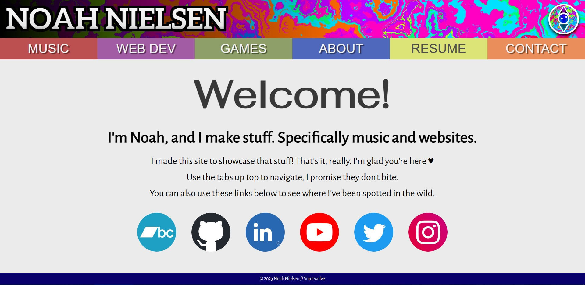

# Portfolio

## Description

A website made to showcase my skills as a musician and a web developer, with a focus on the hiring-manager audience.

## Technologies

This website uses React and React Router to present itself as a Single-Page Application.

## Visit + Usage

Take a look for yourself! [https://www.sumtwelve.net](https://www.sumtwelve.net)

There are six pages to navigate between, excluding the homepage. Use the colored tabs underneath the header to navigate. On mobile, these menu options are collapsed and can be found by tapping on "menu" under the header.

The "WEB DEV" tab will take you to my web developer portfolio, which is in fact the page I link directly to in my resume.

On every page, the "Go Back" button will navigate you to your most recent page, and the "Home" button will take you to the homepage. You can also return to the homepage by clicking on my name in the header.